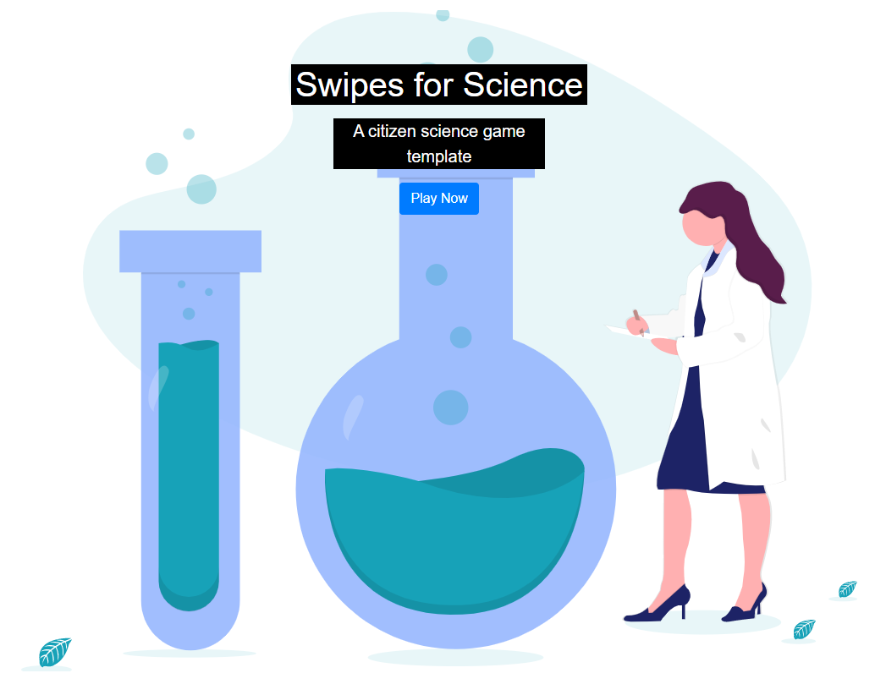

## Project info
<!-- *Please fill this in first and then submit the issue* -->

**Title**:
<!--Name of your awesome project. Please also update the title of the issue to be the title of your project-->

Building Citizen Science Quality Control Exploratory Data Analysis & Other Tools

**Project leads**:
<!--Your name and GitHub login, possibly more than 1 lead-->

From the [Oregon Health & Science University (OHSU) Developmental Cognition and Neruoimaging (DCAN) Labs](https://www.ohsu.edu/dcan) in Portland, OR, USA:

- [Eric Earl](https://ericearl.github.io/), https://github.com/ericearl
- [Anders Perrone](https://www.ohsu.edu/school-of-medicine/developmental-cognition-and-neuroimaging-lab/research-assistants), https://github.com/perronea

**[Timezone](https://github.com/ohbm/hackathon2020/blob/master/.github/ISSUE_TEMPLATE/handbooks/projects.md#timezone)**: UTC -7 hours
<!--UTC offset of your timezone (cf. https://www.timeanddate.com/time/map/ for example).-->

**Hub**: The Americas
<!--Asia and Pacific / Europe, Middle East and Africa / The Americas based on location of project lead. Possibly more than 1 hub.-->

**Maximum number of participants**: 6 (+ 2 leads)

**Description**:
<!--Describe the main idea and context of your project in a few sentences.-->

> "Big data in biomedical research needs individual inspection, but this doesn’t scale for large datasets."
>
> ~ Swipes For Science

Swipes For Science is a web application to expedite visual quality control and can easily be set up and customized for any researcher’s personal needs. It was designed by Anisha Keshavan, PhD, et al, and inspired by the Tinder app. Scientists of any skill level can create an account and swipe left or right to judge an image as Pass or Fail. Each vote is recorded into a live online database that can be visualized for efficient data inclusion or exclusion in a study. While this platform can be simply leveraged by experts on a small scale to make the quality control process more efficient and organized it may also be used to crowd source quality control by “citizen scientists” for large-scale datasets with proven accuracy that matches expert raters.

We have a unique opportunity at this OHBM Brainhack 2020 for you to both setup your own Swipes For Science site and to create exploratory data analysis tools with anonymized data collected from an existent Swipes For Science site. The dataset we’ve included is for QC of outputs from the lightly modified DCAN Labs HCP minimal preprocessing pipeline.

You can imagine answering questions like:
- For all the images associated with one subject's data, should that entire subject be considered a Pass or Fail for inclusion in further analysis?
- For all ratings provided by citizen scientist ABC, how reliably does ABC vote compared to the gold standard data?
- Among all citizen scientists, who are the best raters?
- What is the inter-rater reliability on image XYZ?
- How can we use deep learning to align crowd sourced QC data with gold standard expert evaluation.
... and more!

**Link to project**: https://github.com/DCAN-Labs/SwipesForScienceToolkit

**Mattermost handle**: `earl`

**Goals for the OHBM Brainhack**:

1. Show interested contributors how to set up a SwipesForScience site
2. Share with contributors anonymized data from our SwipesForScience site
3. Create Exploratory Data Analysis Tools for SwipesForScience data

**Good first issues**:

- Import data from JSON format and summarize in a digestible format like CSV.  
- Report basic statistics on subjects and/or users.  
- Visualize swipe data.  

**Skills**:

The more you have beyond the below skills, the more you could do with the project:

- (beginner) Data transformation (munging)
- (beginner) Python
- (beginner) Git/GitHub
- (beginner) Data visualizations
- (confirmed) Basic statistics (mean, variance, etc)
- (barely) NPM/Vue/JavaScript/HTML/CSS

**Chat channel**: https://mattermost.brainhack.org/brainhack/channels/hbm-swipes
<!-- If you are creating a channel on the [brainhack mattermost](https://mattermost.brainhack.org/) try to create a
**public** channel with one of the following template names:

- hbmhack-NAME_OF_YOUR_PROJECT
- hbm-NAME_OF_YOUR_PROJECT

These would be the corresponding URLs that you can paste here.

https://mattermost.brainhack.org/brainhack/channels/hbmhack-NAME_OF_YOUR_PROJECT
https://mattermost.brainhack.org/brainhack/channels/hbm-NAME_OF_YOUR_PROJECT
-->

<!--
**Video channel**:

We are trying to be super careful about "zoom bombing" possibility.
So we want to avoid having links to video chats in "public space".
We suggest that you create a Jitsi or Zoom room and mention it in your text channel as "pinned" message or in the channel header.

-->

**Image for the OHBM brainhack website**

## Project submission

## Submission checklist
*Once the issue is submitted, please check items in this list as you add under 'Additional project info'*

Please include the following above (all required):
-   [x] Link to your project: could be a code repository, a shared document, etc. See [here](https://github.com/ohbm/hackathon2020/blob/master/.github/ISSUE_TEMPLATE/handbooks/projects.md#link-to-project)
-   [x] Include your [Mattermost handle](https://mattermost.brainhack.org/) (i.e. your username). If you do not have an account, please [sign up here](https://mattermost.brainhack.org/signup_email).
-   [x] Goals for the OHBM Brainhack: describe what you want to achieve during this brainhack. See [here](https://github.com/ohbm/hackathon2020/blob/master/.github/ISSUE_TEMPLATE/handbooks/projects.md#goals).
-   [x] Flesh out at least 2 "good first issues": those are tasks that do not require any prior knowledge about your project, could be defined as issues in a GitHub repository, or in a shared document, cf [here](https://github.com/ohbm/hackathon2020/blob/master/.github/ISSUE_TEMPLATE/handbooks/projects.md#onboarding-2-good-first-issues).
-   [x] Skills: list skills that would be particularly suitable for your project. We ask you to include at least one non-coding skill, cf. [here](https://github.com/ohbm/hackathon2020/blob/master/.github/ISSUE_TEMPLATE/handbooks/projects.md#onboarding-skills).
-   [x] Chat channel: A link to a chat channel that will be used during the OHBM Brainhack. This can be an existing channel or a new one. We recommend using the [Brainhack space on mattermost](https://mattermost.brainhack.org/), cf. [here](https://github.com/ohbm/hackathon2020/blob/master/.github/ISSUE_TEMPLATE/handbooks/projects.md#chat).
-   [x] Video channel: Please create a video channel that will be used during the OHBM Brainhack and share it in your chat channel above. This can be an existing channel or a new one. For instance a [jitsi meet](https://meet.jit.si/) room, cf. [here](https://github.com/ohbm/hackathon2020/blob/master/.github/ISSUE_TEMPLATE/handbooks/projects.md#video-calls).
-   [x] Provide an image of your project for the OHBM brainhack website

You can also include information about (all optional):
-   [x] Number of participants, cf. [here](https://github.com/ohbm/hackathon2020/blob/master/.github/ISSUE_TEMPLATE/handbooks/projects.md#participant-capacity)
-   [ ] Twitter-size summary of your project pitch, cf. [here](https://github.com/ohbm/hackathon2020/blob/master/.github/ISSUE_TEMPLATE/handbooks/projects.md#twitter-size-summary-of-your-project-pitch)
-   [ ] Set up a kanban board on your repository to better divide the work and keep track of things, cf [here](https://github.com/ohbm/hackathon2020/blob/master/.github/ISSUE_TEMPLATE/handbooks/projects.md#set-up-a-kanban-board)
-   [ ] Project snippet for the OHBM Brainhack website, cf. [here](https://github.com/ohbm/hackathon2020/blob/master/.github/ISSUE_TEMPLATE/handbooks/projects.md#project-snippet-for-the-ohbm-brainhack-website)

We would like to think about how you will credit and onboard new members to your project. We recommend reading references from [this section](https://github.com/ohbm/hackathon2020/blob/master/.github/ISSUE_TEMPLATE/handbooks/projects.md#credit-and-onboarding). If you'd like to share your thoughts with future project participants, you can include information about (recommended):
-   [ ] Specify how will you acknowledge contributions (e.g. listing members on a contributing page).
-   [ ] Provide links to onboarding documents if you have some.
